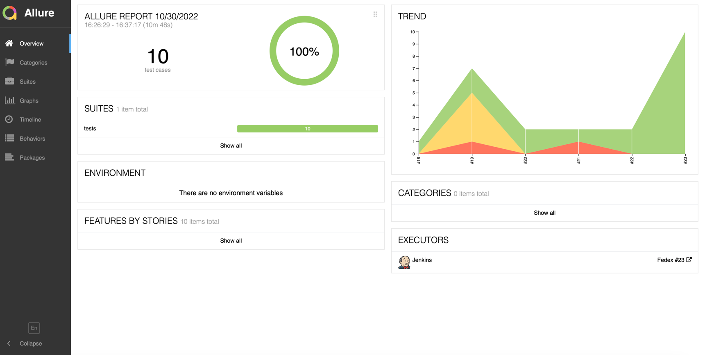

# Fedex Demo Project

* git@github.com:ABialkevich/fedex_demo.git

## Requirements

* **Python** v.3.9 and higher
* **Docker-compose** v3.7 or higher

## Preparation

* install virtualenv library: `pip install virtualenv`
* create virtual env: `virtualenv venv`
* activate virtualenv: `source venv/bin/activate`
* install project libraries: `pip install -r requirements.txt`
* install **Pycharm** app

## Prepare Jenkins Pipeline

* Go to the jenkins
* Create new pipeline
* Go to Pipeline defnition
* Select `Pipeline script from SCM`
* Specify the following paramters:
    * Repository URL: `git@github.com:ABialkevich/fedex_demo.git`
    * Credentials: `your credentials`
    * Branch Specifier (blank for 'any'): `*/main`
    * Script Path: `Jenkinsfile`
* Go to Jenkins Plugins and install `Allure` plugin

### Allure Docker Service

* On Jenkins with common containers also start allure api / frontend services
* Services are available by the following URL:
    * UI: http://localhost:5252/allure-docker-service-ui/ (for local run),
    * Swagger: http://localhost:5050 (for local run)
* Regarding to CI how to get access to services and additional steps will be added later ... 

### e.g 

#### Pipeline Image

#### Allure Report

## Run Tests

### Locally (parallel run)

* Run
  command `python3 -m pytest --alluredir=allure-results --html=report.html --self-contained-html --workers 2 --tests-per-worker 2 tests`

### Remote on CI

* Run recently created Pipeline